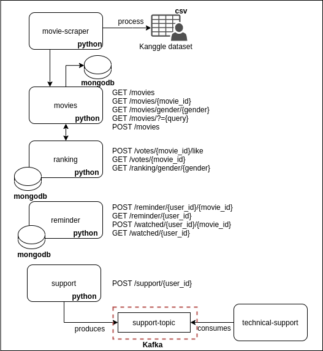

# Netflix Backend

Here we implemented a sample of Netflix's backend. We had designed a Domain Driven Architecture using microservices and Kafka. In order to simulate a real scenario, we pick up a real dataset with 1,000 of the most popular movies on IMDB in the last 10 years.

**Keyword**: 

## Motivation

As an home work for my Master of Business Administration class in [Software Engineer](https://www.fiap.com.br/mba/mba-em-engenharia-de-software/) at [FIAP](https://www.fiap.com.br/), we decided to propose a backend implementation for Netflix. 

With this implementation we intend to provide APIs to:
- List movies by gender
- Visualize movie details
- Provide a vote option to like movies
- Provide a reminder list of movies
- Search movies by keyword
- List ranked movies by gender
- Open a technical support for problems
- List watched movies

## Dataset

In order to simulate a real scenario, we pick up from [Kaggle](https://www.kaggle.com/) an [IMDB dataset](kaggle.com/PromptCloudHQ/imdb-data) with 1,000 of the most popular movies on IMDB in the last 10 years. In this dataset are structured a lot of information about movies, however, to simplify our implementation we took only some of them.

We also designed a script to filter this dataset and build a populated database schema for our microservices.

## Architecture

Here we propose a domain driven architecture with microservices. In order to solve a non-functional requirement we implemented a [Kafka](https://kafka.apache.org/) communication between some services.

### Movies

The [movies](./movies) microservice take account of the movie domain. Their APIs answer questions about movie details, genders of movies and searchs for movies.

### Ranking

The [ranking](./ranking) microservice take account of the votes and movies ranking. Their APIs collect users likes and compute the ranking. Here we also provide a ranking by gender and the top 10 overall movies.

### Reminder

The [reminder](./reminder) microservice collect the reminder and watch later movies list. Their APIs collect users desire for reminder a movie and to set movies as watched.

### Support

The [support](./support) microservice posts the user message to a Kafka topic in order to notify the _technical support_ team.

### Technical Support

The [technical support](./technical-support) reads from the _support-topic_ and logs a message simulating a service order creation.

### Movie Scraper

The [movie scraper](./movie-scraper) reads our dataset and build a populated database schema with all movies.